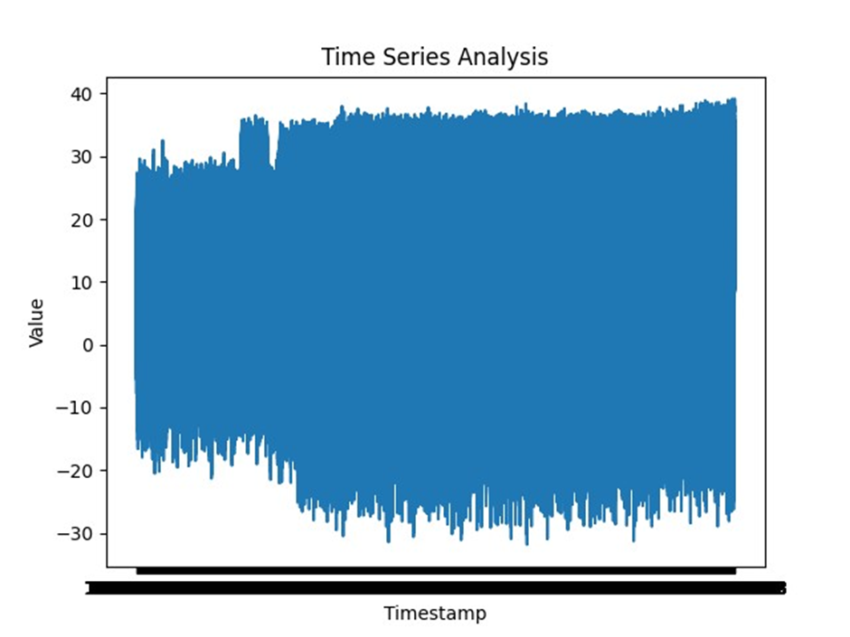

2. `time_series_analysis_script.md` (Time Series Analysis Script Documentation):

```markdown
# Time Series Analysis Script Documentation

## Script Overview

This document provides documentation for the time series analysis script used in the big data analysis project's Phase 4. The script is designed to perform time series analysis on the dataset and derive meaningful insights.

## Usage

To use the time series analysis script, follow these steps:

1. **Prerequisites**: Ensure you have Python installed along with necessary libraries like pandas and statsmodels.

2. **Data Preparation**: Preprocess your time series data as needed.

3. **Script Execution**: Run the `time_series_analysis.py` script. For example:

```cmd
python time_series_analysis.py

## Output
The script generates the following outputs:


## Parameters
data is text formate `text_data ` 

## Author
   Kotipatruni tirumala rao
   
